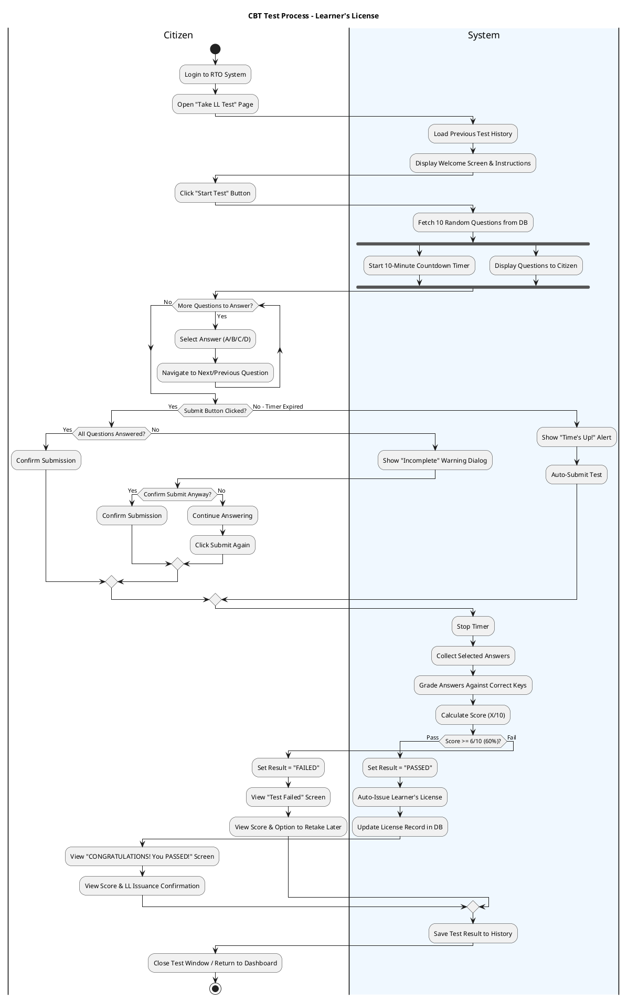
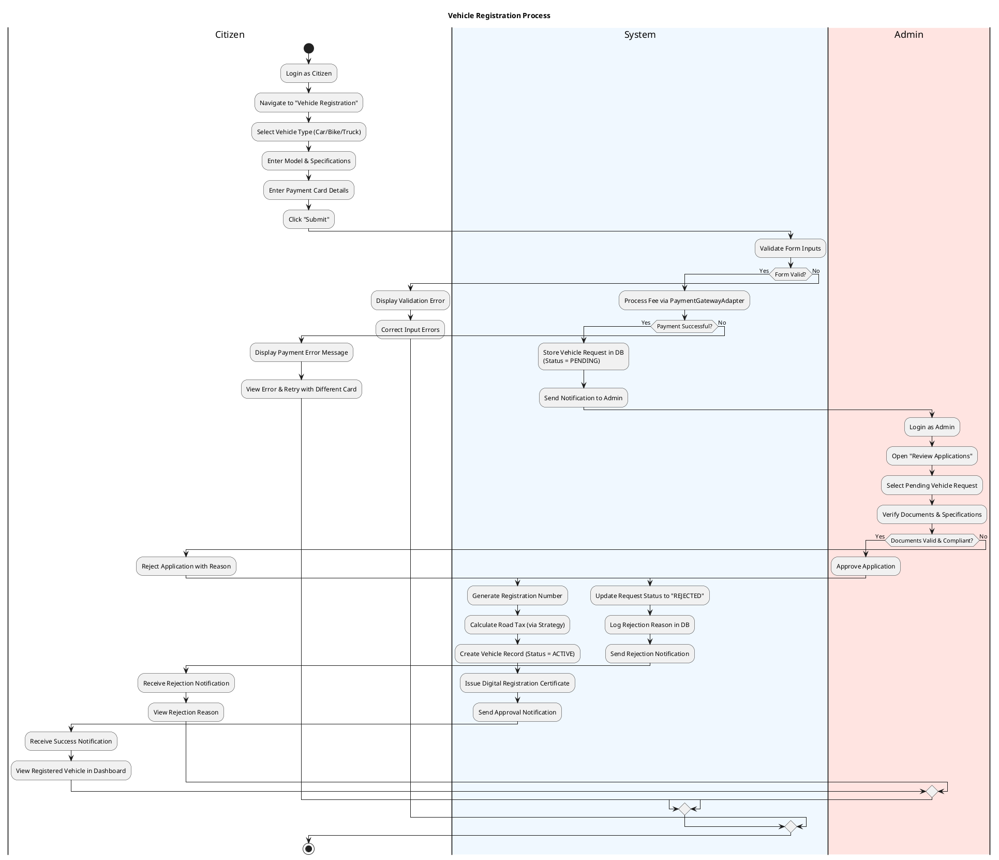
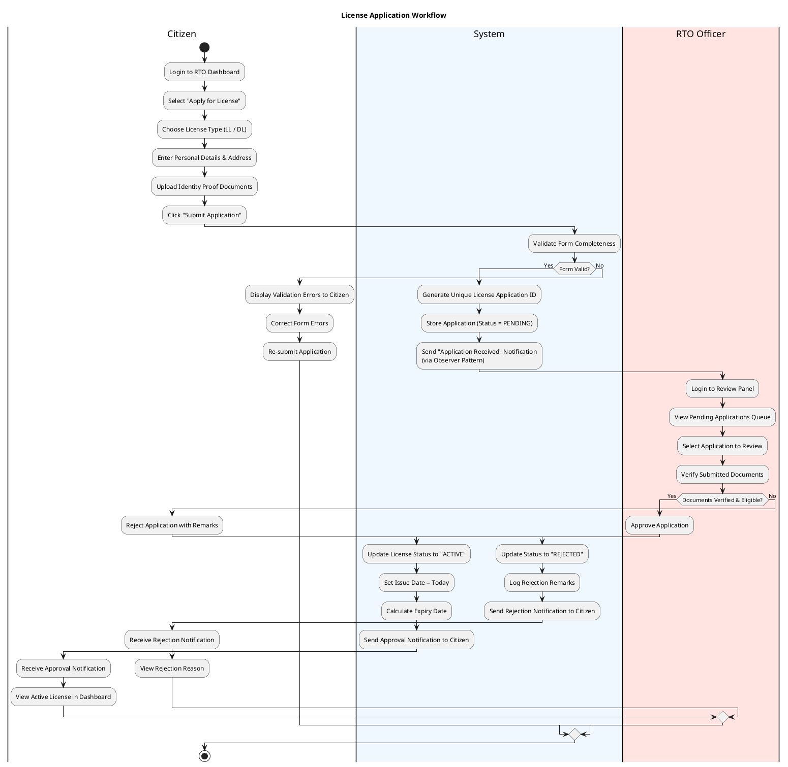
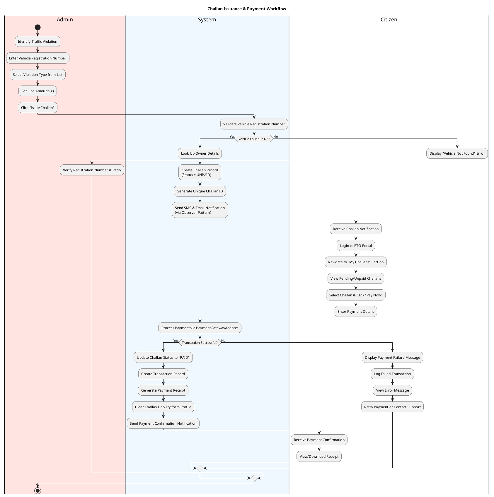

# RTO Office Simulation - UML Activity Diagrams

## 1. CBT Test Process (Learner's License)

This activity diagram demonstrates the operational workflow of the Computer Based Test (CBT) for obtaining a Learner's License.

### Key Logic Points:
1. **Fork/Join**: Timer and question display run concurrently (parallel activities shown with fork bar).
2. **Incomplete Submission**: If not all questions are answered, a confirmation dialog asks whether to submit anyway.
3. **Auto-Submit**: When timer expires, the system force-submits regardless of completion.
4. **Pass Threshold**: Score >= 6/10 triggers automatic Learner's License issuance.
5. **All paths converge** to the final node — no dangling branches.

---

## 2. Vehicle Registration Process

This diagram shows the end-to-end workflow of registering a vehicle, covering Citizen submission, payment, and Admin approval.

### Process Highlights:
1. **Input Validation**: The system validates form inputs before processing payment.
2. **Payment via Adapter**: Uses the `PaymentGatewayAdapter` (Adapter Pattern) for fee processing.
3. **Admin Approval**: Citizens cannot self-register vehicles; an admin must approve pending requests.
4. **Strategy Pattern**: Tax calculation uses the `TaxCalculationStrategy` interface.
5. **All branches converge** to the final node.

---

## 3. License Application Workflow

This diagram models the process of applying for a license (LL or DL) and the administrative review cycle.

### Key Corrections:
1. **Removed invalid `goto`** — PlantUML does not support `goto` labels; replaced with a proper branch that ends cleanly.
2. **Fixed Yes/No swap** — "Documents Verified? → Yes" now correctly leads to **Approve**, and "No" leads to **Reject**.
3. **Observer Pattern** — The notification step explicitly references the Observer design pattern used in code.
4. **All branches converge** to the final node.

---

## 4. Challan Issuance & Payment Workflow

This diagram describes the end-to-end flow of issuing a traffic challan and the citizen's payment process.

### Key Improvements:
1. **Added vehicle validation** — The system first checks if the vehicle exists in the DB before issuing, matching the actual code's validation logic.
2. **Observer Pattern** — Notification step explicitly references the pattern.
3. **Transaction logging** — Added transaction record creation on success and failure logging.
4. **All branches converge** to the final node — no dangling paths.

---

## Summary of Corrections Made

| Diagram | Issue Fixed | UML Rule Enforced |
|---|---|---|
| **CBT Test** | Replaced `detach` with proper merge | Every path must reach a final node |
| **CBT Test** | Added `fork/join` for timer concurrency | Parallel activities require fork bars |
| **CBT Test** | Fixed loop from `repeat/while` to `while/endwhile` | Cleaner rendering of iteration |
| **Vehicle Reg** | Added form validation decision | Complete flow before payment |
| **Vehicle Reg** | Fixed retry/rejection paths to reach `stop` | No dangling branches |
| **License App** | Removed invalid `goto` syntax | PlantUML doesn't support `goto` |
| **License App** | Fixed **Yes/No label swap** on Documents check | Guard conditions must be logically correct |
| **License App** | Fixed re-submit path to end properly | All branches converge |
| **Challan** | Added vehicle existence validation | Matches actual code logic |
| **Challan** | Fixed retry path to reach `stop` | No dangling branches |
| **All 4** | Added `title` to each diagram | Better presentation |
| **All 4** | Used consistent swimlane coloring | Visual clarity |
