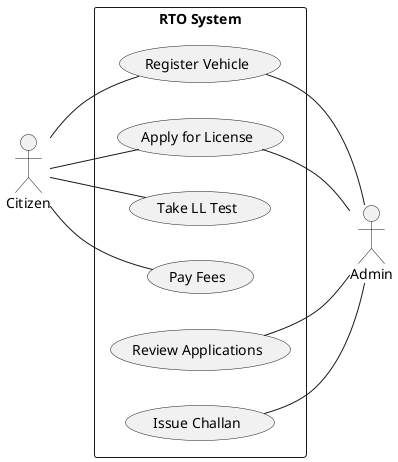

# RTO Management System - Consolidated PlantUML Codes

This document contains all the PlantUML source codes for the project's UML documentation, updated to match the UE23CS352B Mini-Project Guidelines.

---

## 1. Use Case Diagram (Summary)
*Individual use case diagrams and specifications (4 Major, 4 Minor) are located in [use_case_diagram.md](file:///c:/Users/saira/OneDrive/Desktop/RTO_Office_Simulation_Using_Java/docs/use_case_diagram.md)*

---

## 2. Class Diagram
*Full details (46 classes, 8 patterns) in [class_diagram.md](file:///c:/Users/saira/OneDrive/Desktop/RTO_Office_Simulation_Using_Java/docs/class_diagram.md)*

---

## 3. Sequence Diagrams (4)
*Full set of interactions in [sequence_diagram.md](file:///c:/Users/saira/OneDrive/Desktop/RTO_Office_Simulation_Using_Java/docs/sequence_diagram.md)*
1. User Authentication (Login)
2. Vehicle Registration Flow
3. License Application Flow
4. Admin Review Flow

---

## 4. State Diagrams (4)
*Lifecycle modeling in [state_diagram.md](file:///c:/Users/saira/OneDrive/Desktop/RTO_Office_Simulation_Using_Java/docs/state_diagram.md)*
1. License Lifecycle (PENDING -> LL -> DL)
2. Vehicle Request Status (UNDER REVIEW -> APPROVED)
3. Challan Lifecycle (UNPAID -> PAID -> OVERDUE)
4. Payment Transaction States (PENDING -> SUCCESS/FAILED)

---

## 5. Activity Diagrams (4)
*Process workflows in [activity_diagram.md](file:///c:/Users/saira/OneDrive/Desktop/RTO_Office_Simulation_Using_Java/docs/activity_diagram.md)*
1. CBT Test Process (Timed Quiz)
2. Vehicle Registration Workflow (Citizen + Admin)
3. License Application Process
4. Challan Issuance & Payment Workflow

---

## 6. Architectural Diagrams
*Details in [architectural_diagrams.md](file:///c:/Users/saira/OneDrive/Desktop/RTO_Office_Simulation_Using_Java/docs/architectural_diagrams.md)*
1. Component Diagram (MVC + Service Layers)
2. Deployment Diagram (Physical Nodes)

---

## 7. Reports & Documentation
- **[Problem Statement & Synopsis](file:///c:/Users/saira/OneDrive/Desktop/RTO_Office_Simulation_Using_Java/docs/problem_statement.md)**
- **[Design Patterns & Principles](file:///c:/Users/saira/OneDrive/Desktop/RTO_Office_Simulation_Using_Java/docs/design_patterns_principles.md)** (MVC, Creational/Structural/Behavioral, SOLID)
