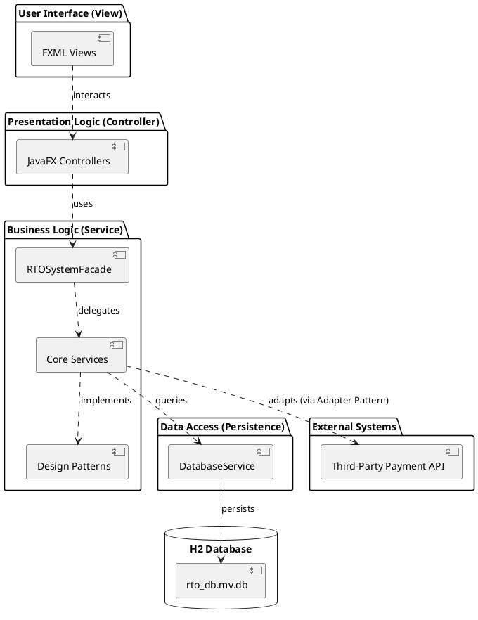
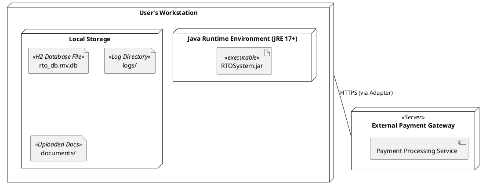

# RTO Office Simulation - UML Component Diagram

This diagram shows the high-level software components and their physical/logical organization following the MVC and Service-Layer architecture.

---

# RTO Office Simulation - UML Deployment Diagram

This diagram illustrates the physical deployment structure of the application.

