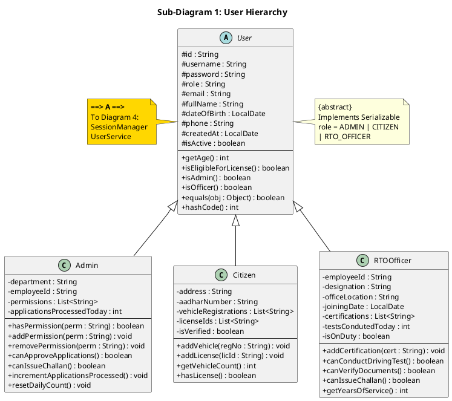
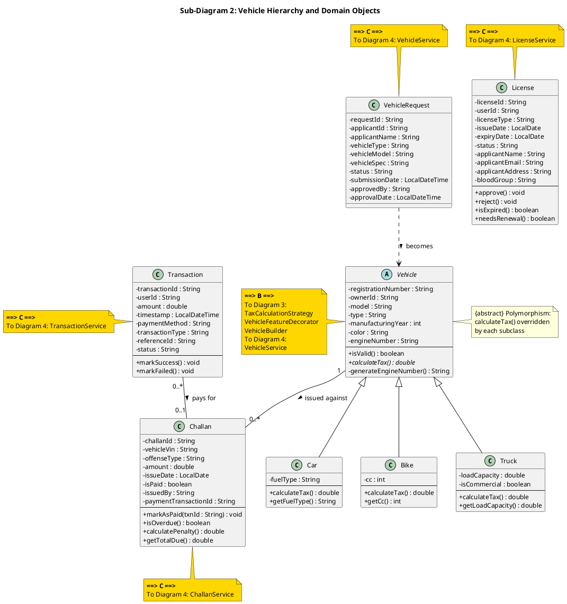

# RTO Office Simulation - UML Class Diagrams

Split into **4 sub-diagrams** connected via **gold connector notes** (A, B, C, D, E).

### Cross-Reference Legend

| Connector | Shared Class | Connects |
|:---:|---|---|
| **A** | `User` | Diagram 1 ↔ Diagram 4 |
| **B** | `Vehicle` | Diagram 2 ↔ Diagram 3 ↔ Diagram 4 |
| **C** | `License, Challan, Transaction, VehicleRequest` | Diagram 2 ↔ Diagram 4 |
| **D** | `NotificationSubject` | Diagram 3 ↔ Diagram 4 |
| **E** | `IPaymentProcessor` | Diagram 3 ↔ Diagram 4 |

---

## Sub-Diagram 1: User Hierarchy



---

## Sub-Diagram 2: Vehicle Hierarchy & Domain Objects



---

## Sub-Diagram 3: Design Patterns

```plantuml
@startuml
title Sub-Diagram 3: Design Patterns

skinparam classAttributeIconSize 0
skinparam classFontSize 14
skinparam defaultFontSize 12

' ===== REFERENCE: Vehicle from Diagram 2 =====

class "Vehicle" as VehicleRef #LightGray {
  (from Diagram 2)
  --
  + calculateTax() : double
}

note top of VehicleRef #Gold
  **<== B <==**
  From Diagram 2
end note

' ===== STRATEGY PATTERN =====

interface TaxCalculationStrategy {
  + calculateTax(v : Vehicle) : double
  + getStrategyName() : String
}

class StandardTaxStrategy {
  + calculateTax(v : Vehicle) : double
  + getStrategyName() : String
}

class PremiumTaxStrategy {
  + calculateTax(v : Vehicle) : double
  + getStrategyName() : String
}

class CommercialTaxStrategy {
  + calculateTax(v : Vehicle) : double
  + getStrategyName() : String
}

TaxCalculationStrategy <|.. StandardTaxStrategy
TaxCalculationStrategy <|.. PremiumTaxStrategy
TaxCalculationStrategy <|.. CommercialTaxStrategy

TaxCalculationStrategy ..> VehicleRef : uses >

note top of TaxCalculationStrategy : <<Strategy Pattern>>

' ===== OBSERVER PATTERN =====

interface NotificationObserver {
  + update(message : String) : void
  + getObserverType() : String
}

class NotificationSubject {
  - observers : List<NotificationObserver>
  --
  + attach(obs : NotificationObserver) : void
  + detach(obs : NotificationObserver) : void
  + notifyObservers(msg : String) : void
}

class EmailNotifier {
  - email : String
  --
  + update(message : String) : void
  + getObserverType() : String
}

class SMSNotifier {
  - phone : String
  --
  + update(message : String) : void
  + getObserverType() : String
}

NotificationObserver <|.. EmailNotifier
NotificationObserver <|.. SMSNotifier
NotificationSubject o-- "0..*" NotificationObserver

note top of NotificationSubject : <<Observer Pattern>>

note left of NotificationSubject #Gold
  **==> D ==>**
  To Diagram 4:
  LicenseService
end note

' ===== ADAPTER PATTERN =====

interface IPaymentProcessor {
  + processPayment(amount : double) : boolean
}

class PaymentGatewayAdapter {
  - api : SimulatedThirdPartyPaymentAPI
  - cardNumber : String
  - cvv : String
  --
  + processPayment(amount : double) : boolean
}

class SimulatedThirdPartyPaymentAPI {
  - apiKey : String
  - merchantId : String
  --
  + makeTransaction(card : String, cvv : String, amt : double) : boolean
  + checkBalance(card : String, cvv : String) : double
  + refundTransaction(ref : String, amt : double) : boolean
  + verifyCard(card : String, cvv : String) : boolean
  - luhnCheck(cardNumber : String) : boolean
}

IPaymentProcessor <|.. PaymentGatewayAdapter
PaymentGatewayAdapter --> SimulatedThirdPartyPaymentAPI : adapts >

note bottom of PaymentGatewayAdapter : <<Adapter Pattern>>

note right of IPaymentProcessor #Gold
  **==> E ==>**
  To Diagram 4:
  RTOSystemFacade
end note

' ===== DECORATOR PATTERN =====

abstract class VehicleFeatureDecorator {
  # decoratedVehicle : Vehicle
  --
  + calculateTotalCost() : double
  + {abstract} getAdditionalCost() : double
  + {abstract} getFeatureDescription() : String
}

class InsuranceDecorator {
  - INSURANCE_COST : double = 15000.0
  --
  + getAdditionalCost() : double
  + getFeatureDescription() : String
}

class ExtendedWarrantyDecorator {
  - WARRANTY_COST : double = 8000.0
  --
  + getAdditionalCost() : double
  + getFeatureDescription() : String
}

VehicleFeatureDecorator <|-- InsuranceDecorator
VehicleFeatureDecorator <|-- ExtendedWarrantyDecorator
VehicleFeatureDecorator o-- VehicleRef : decorates >

note left of VehicleFeatureDecorator : <<Decorator Pattern>>

' ===== BUILDER PATTERN =====

class VehicleBuilder {
  - ownerId : String
  - model : String
  - type : String
  - extraData : String
  - color : String
  - manufacturingYear : int
  - engineNumber : String
  --
  + setOwnerId(id : String) : VehicleBuilder
  + setModel(model : String) : VehicleBuilder
  + setType(type : String) : VehicleBuilder
  + setExtraData(data : String) : VehicleBuilder
  + setColor(color : String) : VehicleBuilder
  + build() : Vehicle
}

VehicleBuilder ..> VehicleRef : creates >

note right of VehicleBuilder : <<Builder Pattern>>

@enduml
```



---

## Sub-Diagram 4: Service Layer & Controllers

```plantuml
@startuml
title Sub-Diagram 4: Service Layer and Controllers

skinparam classAttributeIconSize 0
skinparam classFontSize 14
skinparam defaultFontSize 12

interface IService {
  + initialize() : void
}

class DatabaseService {
  - {static} instance : DatabaseService
  - connection : Connection
  --
  - DatabaseService()
  + {static} getInstance() : DatabaseService
  + executeQuery(sql : String) : ResultSet
  + executeUpdate(sql : String) : boolean
}

note bottom of DatabaseService : <<Singleton Pattern>>

class SessionManager {
  - {static} instance : SessionManager
  - currentUser : User
  --
  - SessionManager()
  + {static} getInstance() : SessionManager
  + login(user : User) : void
  + logout() : void
  + isLoggedIn() : boolean
  + getCurrentUser() : User
}

note bottom of SessionManager #Gold
  <<Singleton Pattern>>
  ----
  **<== A <==**
  From Diagram 1: User
end note

class ServiceFactory {
  --
  + {static} getService(type : String) : IService
  + {static} getVehicleService() : VehicleService
  + {static} getLicenseService() : LicenseService
  + {static} getUserService() : UserService
  + {static} getTransactionService() : TransactionService
}

note bottom of ServiceFactory : <<Factory Pattern>>

ServiceFactory ..> IService : creates >

class VehicleService {
  - db : DatabaseService
  --
  + registerVehicle(v : Vehicle) : boolean
  + getVehiclesByOwner(id : String) : List
  + submitVehicleRequest(req) : boolean
  + approveRequest(reqId : String, adminId : String) : boolean
  + rejectRequest(reqId : String) : boolean
}

class LicenseService {
  - db : DatabaseService
  - notificationSubject : NotificationSubject
  --
  + applyForLicense(lic : License) : boolean
  + approveLicense(licId : String) : boolean
  + rejectLicense(licId : String) : boolean
  + getLicensesByUser(userId : String) : List
}

class ChallanService {
  - db : DatabaseService
  --
  + issueChallan(c : Challan) : boolean
  + getChallansByVehicle(vin : String) : List
  + payChallan(challanId : String, txnId : String) : boolean
  + getTotalUnpaidAmount(vin : String) : double
}

class UserService {
  - db : DatabaseService
  --
  + authenticate(user : String, pass : String) : User
  + registerUser(user : String, pass : String, email : String) : boolean
  + getAllUsers() : List
  + updateUser(user : User) : boolean
}

class TransactionService {
  - db : DatabaseService
  --
  + recordTransaction(txn : Transaction) : boolean
  + getTransactionsByUser(userId : String) : List
}

class TransferService {
  - db : DatabaseService
  --
  + initiateTransfer(reg : String, seller : String, buyer : String) : boolean
  + approveTransfer(id : String) : boolean
}

class CBTService {
  - db : DatabaseService
  --
  + getRandomQuestions(count : int) : List
  + submitTestResult(userId : String, score : int, total : int) : boolean
  + getTestHistory(userId : String) : List
}

IService <|.. VehicleService
IService <|.. LicenseService
IService <|.. ChallanService
IService <|.. UserService
IService <|.. TransactionService
IService <|.. TransferService
IService <|.. CBTService

VehicleService --> DatabaseService
LicenseService --> DatabaseService
ChallanService --> DatabaseService
UserService --> DatabaseService
TransactionService --> DatabaseService
TransferService --> DatabaseService
CBTService --> DatabaseService

note left of UserService #Gold
  **<== A <==**
  From Diagram 1: User
end note

note left of VehicleService #Gold
  **<== B <==**
  From Diagram 2: Vehicle
  **<== C <==**
  From Diagram 2: VehicleRequest
end note

note left of LicenseService #Gold
  **<== C <==**
  From Diagram 2: License
  **<== D <==**
  From Diagram 3: NotificationSubject
end note

note left of ChallanService #Gold
  **<== C <==**
  From Diagram 2: Challan
end note

note left of TransactionService #Gold
  **<== C <==**
  From Diagram 2: Transaction
end note

class RTOSystemFacade {
  - session : SessionManager
  - userService : UserService
  - vehicleService : VehicleService
  - licenseService : LicenseService
  - transactionService : TransactionService
  --
  + login(user : String, pass : String) : User
  + logout() : void
  + registerUser(user : String, pass : String, email : String) : boolean
  + registerVehicle(type : String, model : String, spec : String) : boolean
  + applyForLicense(type : String, name : String, email : String, addr : String, bg : String) : boolean
  + processPayment(amount : double, method : String, type : String, refId : String) : boolean
}

note right of RTOSystemFacade
  <<Facade Pattern>>
  Single entry point.
  Controllers ONLY talk
  to this class.
end note

note left of RTOSystemFacade #Gold
  **<== E <==**
  From Diagram 3:
  IPaymentProcessor
end note

RTOSystemFacade --> SessionManager
RTOSystemFacade --> UserService
RTOSystemFacade --> VehicleService
RTOSystemFacade --> LicenseService
RTOSystemFacade --> TransactionService

class LoginController {
  - rtoSystem : RTOSystemFacade
  --
  + initialize() : void
  + handleLogin() : void
  + handleRegister() : void
}

class DashboardController {
  - rtoFacade : RTOSystemFacade
  - isAdmin : boolean
  --
  + initialize() : void
  - setupAdminTabs() : void
  - setupCitizenTabs() : void
  + handleLogout() : void
}

class RegistrationController {
  - rtoFacade : RTOSystemFacade
  --
  + initialize() : void
  + handleSubmit() : void
}

class LicenseController {
  - rtoFacade : RTOSystemFacade
  --
  + initialize() : void
  + handleSubmit() : void
}

class CBTController {
  - rtoFacade : RTOSystemFacade
  --
  + initialize() : void
  + startTest() : void
  + submitTest() : void
}

class TransferController {
  - rtoFacade : RTOSystemFacade
  --
  + initialize() : void
  + handleTransfer() : void
}

LoginController --> RTOSystemFacade
DashboardController --> RTOSystemFacade
RegistrationController --> RTOSystemFacade
LicenseController --> RTOSystemFacade
CBTController --> RTOSystemFacade
TransferController --> RTOSystemFacade

class ValidationEngine {
  --
  + {static} isValidUsername(user : String) : boolean
  + {static} isValidPassword(pass : String) : boolean
  + {static} isValidEmail(email : String) : boolean
  + {static} isValidPhone(phone : String) : boolean
}

@enduml
```



---

## How to Read the Connectors

**Outgoing connector (source diagram):**
```
 ==> A ==>   means "this class connects OUT to connector A"
```

**Incoming connector (target diagram):**
```
 <== A <==   means "connector A comes IN from another diagram"
```

**Example:** Match **==> A ==>** on `User` in Diagram 1 with **<== A <==** on `SessionManager` and `UserService` in Diagram 4.

## Cross-Reference Map

| Connector | Source (==> out) | Target (<== in) |
|:---:|---|---|
| **A** | Diagram 1: `User` | Diagram 4: `SessionManager`, `UserService` |
| **B** | Diagram 2: `Vehicle` | Diagram 3: gray `Vehicle` stub; Diagram 4: `VehicleService` |
| **C** | Diagram 2: `License`, `Challan`, `Transaction`, `VehicleRequest` | Diagram 4: `LicenseService`, `ChallanService`, `TransactionService`, `VehicleService` |
| **D** | Diagram 3: `NotificationSubject` | Diagram 4: `LicenseService` |
| **E** | Diagram 3: `IPaymentProcessor` | Diagram 4: `RTOSystemFacade` |

## Design Patterns (9 total)

| # | Pattern | Key Classes | Diagram |
|---|---|---|:---:|
| 1 | Inheritance + Polymorphism | User and Vehicle hierarchies | 1, 2 |
| 2 | Strategy | TaxCalculationStrategy + 3 impl | 3 |
| 3 | Observer | NotificationSubject + EmailNotifier, SMSNotifier | 3 |
| 4 | Adapter | PaymentGatewayAdapter + SimulatedThirdPartyPaymentAPI | 3 |
| 5 | Decorator | VehicleFeatureDecorator + Insurance, Warranty | 3 |
| 6 | Builder | VehicleBuilder | 3 |
| 7 | Singleton | DatabaseService, SessionManager | 4 |
| 8 | Factory | ServiceFactory | 4 |
| 9 | Facade | RTOSystemFacade | 4 |

## UML Compliance

| Rule | Status |
|---|:---:|
| 3-compartment classes (Name / Attributes / Methods) | ✅ |
| Visibility modifiers (+ public, - private, # protected) | ✅ |
| Abstract classes marked | ✅ |
| Interfaces with <<interface>> | ✅ |
| Inheritance: solid line + hollow triangle | ✅ |
| Implementation: dashed line + hollow triangle | ✅ |
| Association with multiplicity | ✅ |
| Aggregation: hollow diamond | ✅ |
| Dependency: dashed arrow | ✅ |
| Off-page connectors between sub-diagrams | ✅ |
