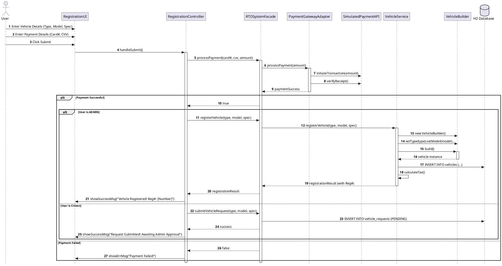
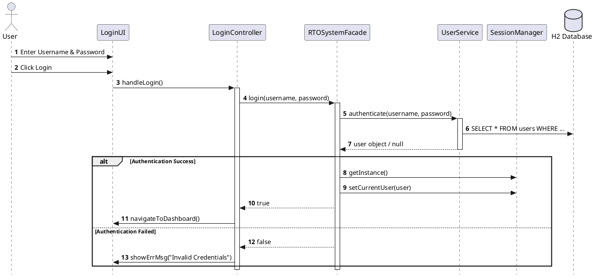
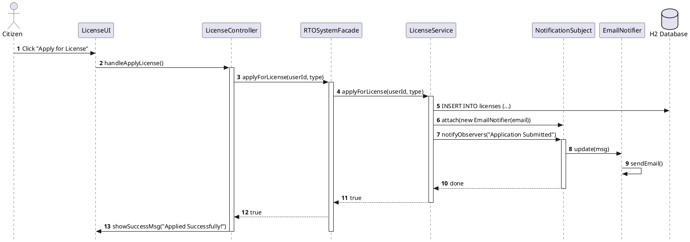
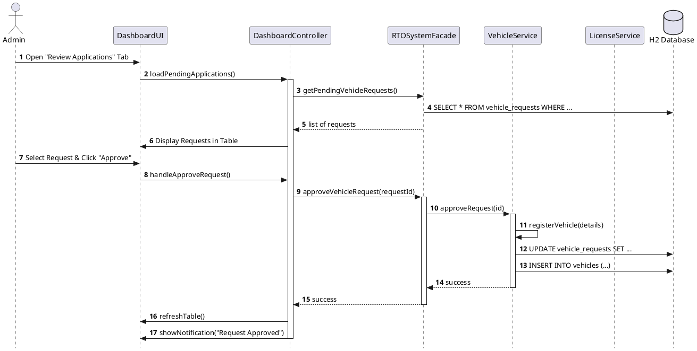

# RTO Office Simulation - UML Sequence Diagram

## Vehicle Registration Flow

This sequence diagram illustrates the process of registering a vehicle, featuring the **Facade**, **Adapter**, and **Builder** design patterns. It handles two flows:
1. **Admin Flow**: Direct registration.
2. **Citizen Flow**: Request submission for admin approval.

### Key Interactions:
1. **Facade Pattern**: The `RTOSystemFacade` simplifies the complex interaction between UI, Payment, and Vehicle services.
2. **Adapter Pattern**: The `PaymentGatewayAdapter` bridges the system logic with a simulated external Payment API.
3. **Builder Pattern**: The `VehicleBuilder` is used by the `VehicleService` to construct complex vehicle objects fluently.
4. **Conditional Logic**: The flow branches based on the User's Role (Admin vs Citizen), demonstrating role-based access control.

---

## 2. User Authentication (Login) Flow

This diagram shows the singleton-based session management and service-oriented authentication.

---

## 3. License Application Flow

Demonstrates the use of the **Observer Pattern** for notifications.

---

## 4. Reviewing Pending Applications (Admin) Flow

