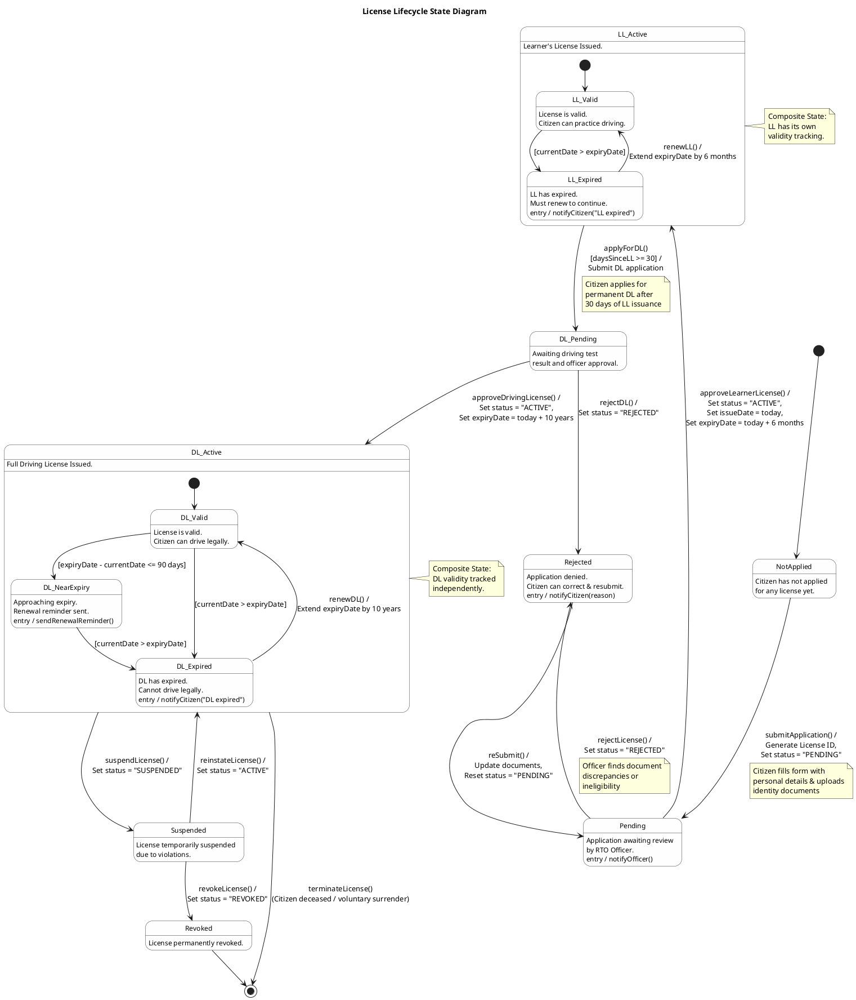
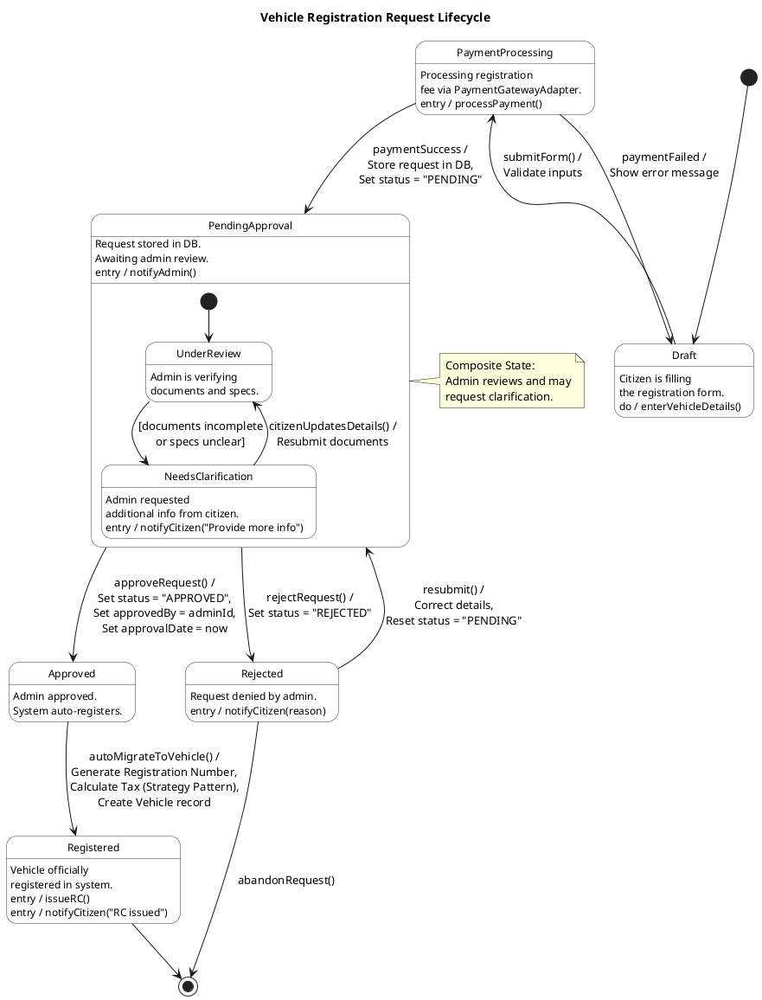
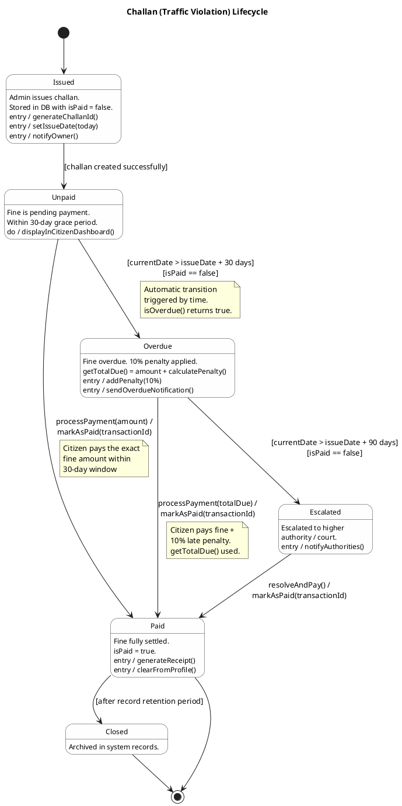
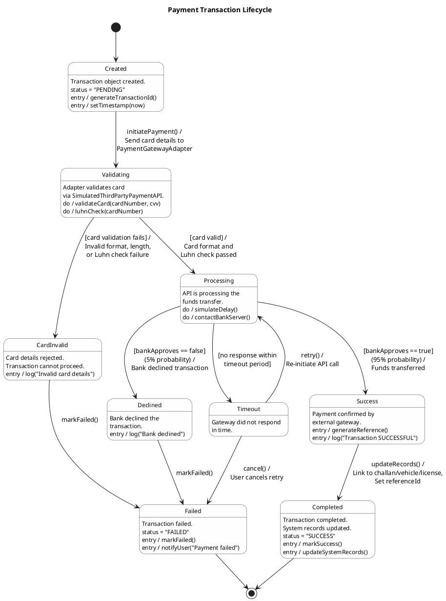

# RTO Office Simulation - UML State Machine Diagrams

## UML State Diagram Compliance

Each diagram follows standard UML State Machine notation:

| Component | Symbol | Present in All 4? |
|---|---|:---:|
| **Initial Pseudo-State** | Filled black circle `[*] -->` | ✅ |
| **Final State** | Bullseye circle `--> [*]` | ✅ |
| **States** | Rounded rectangles | ✅ |
| **Transitions** | Arrows with `event [guard] / action` | ✅ |
| **Guard Conditions** | In square brackets `[condition]` | ✅ |
| **Composite States** | Nested state regions | ✅ (D1, D2) |
| **Entry/Do Activities** | Inside state body | ✅ |
| **Self-Transitions** | Arrow from/to same state | ✅ (D3) |
| **All states reachable** | From initial pseudo-state | ✅ |
| **No orphan states** | Every state has ≥1 incoming transition | ✅ |

---

## 1. License Lifecycle

This state diagram models the complete lifecycle of a license — from application to expiry/revocation. It uses **composite states** to show that both LL and DL have internal validity tracking.

**Maps to:** `License.java` (status field: PENDING, ACTIVE, REJECTED, EXPIRED), `LicenseService.java` (applyForLicense, approveLicense, rejectLicense, renewLicense)

### State Descriptions:
| State | Description | Code Mapping |
|---|---|---|
| **NotApplied** | Citizen hasn't applied yet | No License record exists |
| **Pending** | Application submitted, awaiting officer review | `status = "PENDING"` |
| **Rejected** | Application denied; citizen may resubmit | `status = "REJECTED"` via `reject()` |
| **LL_Active** | Learner's License issued (composite: Valid/Expired) | `status = "ACTIVE"`, `approve()` |
| **DL_Pending** | Applied for permanent DL after CBT pass | `status = "PENDING"` (DL application) |
| **DL_Active** | Full Driving License issued (composite: Valid/NearExpiry/Expired) | `status = "ACTIVE"` |
| **Suspended** | Temporarily suspended due to violations | Extended state |
| **Revoked** | Permanently revoked | Terminal state |

---

## 2. Vehicle Registration Request Lifecycle

This diagram tracks the states of a `VehicleRequest` object from citizen submission through admin review to final registration.

**Maps to:** `VehicleRequest.java` (status: PENDING, APPROVED, REJECTED), `VehicleService.java`, `RTOSystemFacade.java`

### State Descriptions:
| State | Description | Code Mapping |
|---|---|---|
| **Draft** | Citizen filling the form, not yet submitted | UI state in `RegistrationController` |
| **PaymentProcessing** | Fee being processed via Adapter Pattern | `rtoFacade.processPayment()` |
| **PendingApproval** | Stored in DB, awaiting admin (composite: UnderReview / NeedsClarification) | `status = "PENDING"` |
| **Approved** | Admin verified and approved | `status = "APPROVED"` |
| **Rejected** | Admin denied; citizen can resubmit or abandon | `status = "REJECTED"` |
| **Registered** | Vehicle record created with registration number | Vehicle record in DB |

---

## 3. Challan (Traffic Violation) Lifecycle

This diagram models the complete lifecycle of a traffic challan from issuance to payment resolution.

**Maps to:** `Challan.java` (isPaid, isOverdue(), calculatePenalty(), getTotalDue()), `ChallanService.java` (issueChallan, payChallan)

### State Descriptions:
| State | Description | Code Mapping |
|---|---|---|
| **Issued** | Challan created by admin | `new Challan()`, `issueChallan()` |
| **Unpaid** | Active challan within 30-day window | `isPaid = false`, `!isOverdue()` |
| **Overdue** | Past 30 days unpaid, penalty applied | `isOverdue() == true`, `calculatePenalty()` |
| **Escalated** | Past 90 days, referred to authority | Extended state |
| **Paid** | Fine settled | `markAsPaid(txnId)`, `isPaid = true` |
| **Closed** | Archived after retention | Terminal state |

---

## 4. Payment Transaction Lifecycle

This diagram models the internal states of a payment transaction processed through the `PaymentGatewayAdapter` and `SimulatedThirdPartyPaymentAPI`.

**Maps to:** `Transaction.java` (status: PENDING, SUCCESS, FAILED), `PaymentGatewayAdapter.java`, `SimulatedThirdPartyPaymentAPI.java` (makeTransaction, validateCard, luhnCheck)

### State Descriptions:
| State | Description | Code Mapping |
|---|---|---|
| **Created** | Transaction object instantiated | `new Transaction()`, `status = "PENDING"` |
| **Validating** | Card being validated (format, Luhn) | `validateCard()`, `luhnCheck()` in `SimulatedThirdPartyPaymentAPI` |
| **CardInvalid** | Card validation failed | `validateCard()` returns false |
| **Processing** | Funds transfer in progress | `makeTransaction()` in `SimulatedThirdPartyPaymentAPI` |
| **Success** | Bank approved the payment | `makeTransaction()` returns true |
| **Declined** | Bank declined (5% chance in simulation) | `makeTransaction()` returns false |
| **Timeout** | Gateway didn't respond | Extended state for robustness |
| **Failed** | Terminal failure state | `markFailed()`, `status = "FAILED"` |
| **Completed** | All records updated, transaction done | `markSuccess()`, `status = "SUCCESS"` |

---

## Summary

| # | Diagram | Object Modeled | States | Composite? | Code Files |
|---|---|---|:---:|:---:|---|
| 1 | License Lifecycle | `License` | 9 | Yes (LL, DL) | `License.java`, `LicenseService.java` |
| 2 | Vehicle Request | `VehicleRequest` | 7 | Yes (PendingApproval) | `VehicleRequest.java`, `VehicleService.java` |
| 3 | Challan Lifecycle | `Challan` | 6 | No | `Challan.java`, `ChallanService.java` |
| 4 | Payment Transaction | `Transaction` | 9 | No | `Transaction.java`, `PaymentGatewayAdapter.java` |
