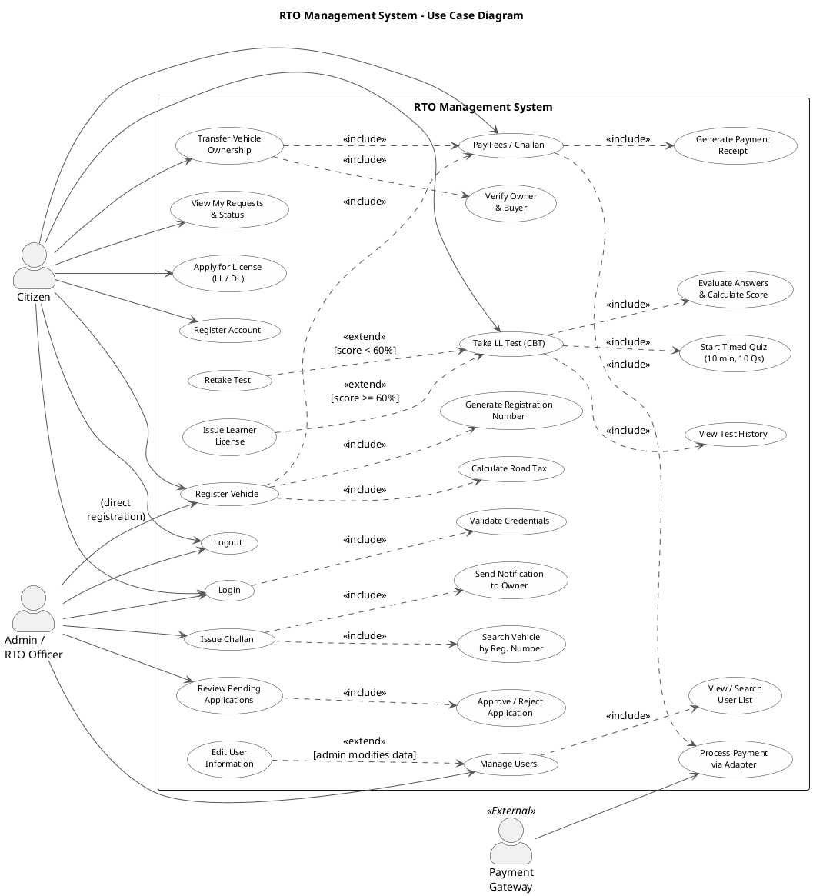

# RTO Office Simulation - Use Case Diagram

## Comprehensive System Use Case Diagram

This is the **complete use case diagram** for the RTO Management System, showing all actors, use cases, and their relationships (`<<include>>` and `<<extend>>`).

### UML Use Case Diagram Compliance

| Component | Rule | Status |
|---|---|:---:|
| **Actors** | Stick figures placed OUTSIDE system boundary | ✅ |
| **Use Cases** | Ovals/ellipses INSIDE system boundary | ✅ |
| **System Boundary** | Single rectangle enclosing all use cases | ✅ |
| **Associations** | Solid lines connecting actors to use cases | ✅ |
| **`<<include>>`** | Dashed arrow FROM base → TO included (mandatory sub-behavior) | ✅ |
| **`<<extend>>`** | Dashed arrow FROM extending → TO base (optional/conditional) | ✅ |
| **Generalization** | Solid arrow with hollow triangle for actor/use case inheritance | ✅ |
| **No implementation detail** | Use cases describe WHAT, not HOW | ✅ |
| **Each use case = meaningful goal** | Complete goal for at least one actor | ✅ |

### Actors

| Actor | Type | Description |
|---|---|---|
| **Citizen** | Primary | End-user who registers, applies, pays, and takes tests |
| **Admin / RTO Officer** | Primary | Administrator who reviews, approves, issues challans |
| **Payment Gateway** | External System | Third-party payment processor (SimulatedThirdPartyPaymentAPI) |

---

---

## Use Case Summary Table

| # | Use Case | Primary Actor | `<<include>>` | `<<extend>>` |
|---|---|---|---|---|
| 1 | Login | Citizen, Admin | Validate Credentials | — |
| 2 | Register Account | Citizen | — | — |
| 3 | Register Vehicle | Citizen, Admin | Calculate Tax, Generate Reg#, Pay Fees | — |
| 4 | Apply for License (LL/DL) | Citizen | — | — |
| 5 | Take LL Test (CBT) | Citizen | View History, Start Quiz, Evaluate Answers | Issue LL [pass], Retake [fail] |
| 6 | Transfer Vehicle Ownership | Citizen | Verify Parties, Pay Fees | — |
| 7 | Issue Challan | Admin | Search Vehicle, Send Notification | — |
| 8 | Pay Fees / Challan | Citizen | Process Payment, Generate Receipt | — |
| 9 | Manage Users | Admin | View/Search User List | Edit User [admin action] |
| 10 | Review Pending Applications | Admin | Approve/Reject | — |
| 11 | View My Requests & Status | Citizen | — | — |
| 12 | Logout | Citizen, Admin | — | — |

---

## Actor–Use Case Mapping

### Citizen Can:
1. **Login** — Authenticate with username and password
2. **Register Account** — Create a new citizen account
3. **Register Vehicle** — Submit vehicle registration (goes to admin approval queue)
4. **Apply for License** — Apply for Learner's or Driving License
5. **Take LL Test (CBT)** — Attempt the 10-question timed computer-based test
6. **Transfer Vehicle Ownership** — Initiate transfer to another registered user
7. **Pay Fees / Challan** — Pay registration fees, license fees, or traffic fines
8. **View My Requests** — Track status of submitted vehicle registration requests
9. **Logout** — End session

### Admin / RTO Officer Can:
1. **Login** — Authenticate with admin credentials
2. **Register Vehicle** — Directly register a vehicle (bypasses approval)
3. **Issue Challan** — Issue traffic violation challans against vehicles
4. **Review Applications** — Review, approve or reject pending citizen requests
5. **Manage Users** — View, search, and edit citizen accounts
6. **Logout** — End session

### Payment Gateway (External):
1. **Process Payment** — Handles actual fund transfer via `PaymentGatewayAdapter` (Adapter Pattern) using `SimulatedThirdPartyPaymentAPI`

---

## Code-to-Use Case Traceability

| Use Case | Controller(s) | Service(s) | Model(s) |
|---|---|---|---|
| Login | `LoginController` | `RTOSystemFacade.login()` | `User` |
| Register Account | `LoginController` | `RTOSystemFacade.registerUser()` | `User` |
| Register Vehicle | `RegistrationController` | `VehicleService`, `RTOSystemFacade` | `Vehicle`, `VehicleRequest` |
| Apply for License | `LicenseController` | `LicenseService`, `RTOSystemFacade` | `License` |
| Take LL Test | `CBTController` | `CBTService` | `CBTQuestion`, `CBTResult` |
| Transfer Ownership | `TransferController` | `TransferService` | `Vehicle` |
| Issue Challan | `DashboardController` | `ChallanService` | `Challan` |
| Pay Fees/Challan | `RegistrationController`, `DashboardController` | `RTOSystemFacade.processPayment()` | `Transaction` |
| Manage Users | `DashboardController` | `DatabaseService` | `User` |
| Review Applications | `DashboardController` | `VehicleService` | `VehicleRequest` |
| View My Requests | `DashboardController` | `VehicleService` | `VehicleRequest` |
| Logout | `DashboardController` | `SessionManager.logout()` | — |
